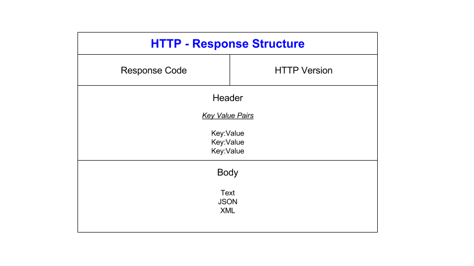

# API (Application Programming Interface)

## What are APIs

APIs are mechanisms that enable two software components to communicate with each other using a set of definitions and protocols. The software components are the 'applications' and the mechanism is the 'interface', hence 'Application programming interface'. 

APIs are usually explained in terms of a client and a server. The application sending the request is called the client, and the application sending the response is called the server. 

API endpoints are the final touchpoints in the API communication system. These include server URLs, services, and other specific digital locations from where information is sent and received between systems. 


APIs can be used to integrate new applications with existing software systems. Since we are reusing existing code, this can dramatically increase development speed and so APIs are very popular.  

There are 4 different kinds of API architectures:
1. **SOAP**:
SOAP stands for Simple Object Access Protocol, where the client and server exchange messages using XML.<br>
While outdated, SOAP is still sometimes used since compared to REST, SOAP is language, platform, and transport independent (REST requires use of HTTP) Works well in distributed enterprise environments (REST assumes direct point-to-point communication). For example, SOAP is used in bank transfers. 
2. **RPC**:
RPC stands for Remote Procedure Call, where the client completes a function on the server and the server sends the output back to the client.<br>
RPC allows developers to call remote functions in external servers as if they were local to their software. For example, you can add chat functionality to your application by remotely calling messaging functions on another chat application.
3. **Websocket**:
A web API that uses JSON objects to pass data. The communication between the server and the client is two-way, so the server can send callback messages to the client which allows for code execution in response to an event For example, run this code every time a user presses this key on their keyboard.
4. **REST**: REST stands for Representational State Transfer. It is another web API where the client sends requests to the server as data and the server uses this data to run functions and return output data back to the client.

## REST and RESTful APIs

An API is 'RESTful' if it uses HTTP requests to access and use data. The data transmitted can be delivered over HTTP in many different formats: JSON, HTML, XLT, Python or plaintext to name a few. For REST APIs, there are some guidelines that they must follow:

1. A client-server architecture made up of clients, servers, and resources, with requests managed through HTTP.
2. Stateless client-server communication, so no client information is stored between get requests and each request is separate and unconnected.
3. Cacheable data that streamlines client-server interactions.
4. A uniform interface between components so that information is transferred in a standard form. This requires that:
    - resources requested are identifiable and separate from the representations sent to the client.
    - resources can be manipulated by the client via the representation they receive because the representation contains enough information to do so.
    - self-descriptive messages returned to the client have enough information to describe how the client should process it.
    - hypertext/hypermedia is available, meaning that after accessing a resource the client should be able to use hyperlinks to find all other currently available actions they can take.
5. A layered system that organizes each type of server (those responsible for security, load-balancing, etc.) involved the retrieval of requested information into hierarchies, invisible to the client.
6. Code-on-demand: the ability to send executable code from the server to the client when requested, extending client functionality. 

These guidelines are quite strict so many APIs do not conform to every element of REST, and so RESTful APIs are useful for following standards while remaining flexible and lightweight. (**1, 2 and 3** are most commonly implemented)

## HTTP

HTTP stands for Hypertext Transfer Protocol and is an application layer protocol designed to transfer information between networked devices and runs on top of other layers of the network protocol stack.


The application layer contains the communications protocols, including HTTP, and interface methods used in process-to-process communications across an Internet Protocol (IP) computer network.

### HTTPS

HTTPS stands for Hypertext Transfer Protocol Secure and is an extension of HTTP. It implements encryption for data being tranmitted (e.g. when paying for something online) to ensure secure communication which is especially useful over the internet. It uses Transport Layer Security (TLS) or, formerly, Secure Sockets Layer (SSL) for encryption and so the protocol is also referred to as HTTP over TLS or HTTP over SSL.

A typical flow over HTTP involves a client machine making a request to a server, which then sends a response message. Some HTTP methods include GET, PUT and DELETE

### HTTP request


A typical HTTP request contains:

1. HTTP version type<br>
E.g. HTTP/1.0, HTTP/1.1 ...
2. a URL<br>
E.g. www.google.com
3. an HTTP method/verb
E.g. GET, POST<br>
A ‘GET’ request expects information back in return (usually in the form of a website), while a ‘POST’ request typically indicates that the client is submitting information to the web server (such as form information, e.g. a submitted username and password).
4. HTTP request headers<br>
HTTP headers contain text information stored in key-value pairs. These headers communicate core information, such as what browser the client is using and what data is being requested.

5. Optional HTTP body<br>
The body of a request is the part that contains the actual information the request is transferring such as any information being submitted to the web server e.g. username and password, or any other data entered into a form.

### HTTP response



A typical HTTP response contains:

1. an HTTP status code<br>
3 digit codes used to indicate whether a successful HTTP request has been completed. There are 5 kinds:
   - 1xx Informational
   - 2xx Success E.g. 200 (Ok)
   - 3xx Redirection 
   - 4xx Client Error E.g. 404 (Not Found)
   - 5xx Server Error

2. HTTP response headers<br>
Similar to HTTP request headers they communicate the core information required.

3. optional HTTP body<br>
The requested information. In most web requests, this is HTML data that a web browser will translate into a webpage.

### HTTP verbs

These are the methods that can be called in a HTTP request. These correspond to create, read, update, and delete (or CRUD) operations, respectively. There are a number of other verbs, too, but are utilized less frequently They are:
1. **POST**<br>
CREATE - creates new resources. On successful creation, return HTTP status 201, returning a Location header with a link to the newly-created resource with the 201 HTTP status.
```
POST /submit-form HTTP/1.1
Host: www.example.com
Content-Type: application/x-www-form-urlencoded

username=user&password=pass
```
2. **GET**<br>
READ - reads a representation of a resource.  In the “happy” (or non-error) path, GET returns a representation in XML or JSON and an HTTP response code of 200 (OK). In an error case, it most often returns a 404 (NOT FOUND) or 400 (BAD REQUEST).
```
GET /example HTTP/1.1
Host: www.example.com
```
3. **PUT**<br>
UPDATE - updates a resource, or creates it if it does not exist (not reccomended). On successful update, return 200 (or 204 if not returning any content in the body) from a PUT. If using PUT for create, return HTTP status 201 on successful creation.
```
PUT /users/123 HTTP/1.1
Host: www.example.com
Content-Type: application/json

{
    "name": "John Doe",
    "age": 30,
    "email": "john@example.com"
}
```
4. **PATCH**<br>
UPDATE - modifies a resource. Similar to PUT, but the body contains a set of instructions describing how a resource currently residing on the server should be modified to produce a new version. This means that the PATCH body should not just be a modified part of the resource, but in some kind of patch language like JSON Patch or XML Patch.
```
PATCH /users/123 HTTP/1.1
Host: www.example.com
Content-Type: application/json

{
    "age": 31
}
```
5. **DELETE**<br>
DELETE - deletes a resource. On successful deletion, return HTTP status 200 (OK) along with a response body, perhaps the representation of the deleted item (often demands too much bandwidth), or a wrapped response. Either that or return HTTP status 204 (NO CONTENT) with no response body.
```
DELETE /users/123 HTTP/1.1
Host: www.example.com
```
## Statelessness

In stateless client-server communication, each request is separate and unconnected so no client information is stored between requests. Therefore, each request from a client to a server must contain all the information necessary to understand the request

An example of a stateless request could be:
```
GET /profile HTTP/1.1
Host: www.example.com
Cookie: session_token=abcdef1234567890
```
This is in contrast to a corresponding stateful request:
```
GET /example HTTP/1.1
Host: www.example.com
```

In this stateful request, the server is relying on information stored on the client side/server side to maintain the state of the request. In the stateless request, there is no additional information required, as all the information needed is required in the request.

As a result, in stateful requests, you may be waiting on the result of other requests, which can slow down the response time and reduce efficiency. This is why stateless requests are preferred. 

## Caching

Caching is storing frequently used data in a temporary storage to speed up data access as the data is not required to be fetched from the original source. For example, the data can be retrieved from the cache stored on your local system rather than fetching it from a server. 

The data stored is only data that is frequently used as cache storage is typically small. This is because it is unfeasible to store all data encountered in the cache permanently. 

For example, when browsing the web, the web data is first fetched from the server, and a local copy is saved to your cache. When you need to access the website again, rather than fetching the data from the server, the data is fetched from your cache which dramatically decreases the response time. After a while, or if it fills up, the cache may be reset to allow for new websites to be added.


