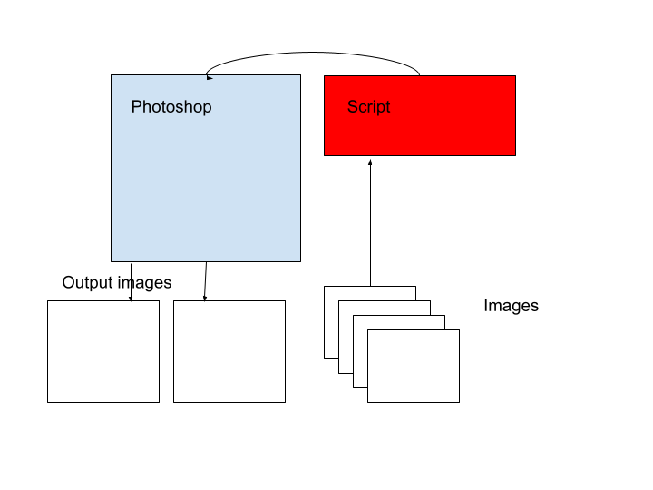

# Scripting

## What is scripting?

**Scripting** is writing code that is used to automate repetitive processes. It typically extends on or modifies existing programs.
The code is small scale and is usually interpreted rather than complied. This makes Python an ideal programming language for
scripting.

**Programming**, on the other hand, is a broader term that involves creating new programs or software. Programming encompasses
a lot of the steps in software development, including designing, writing, testing and compiling code. The code written is usually
more complex than in scripting

A simple example would be the task of editing images. We can use a program, like Photoshop, to edit a single image easily.
However, if we wanted to edit many images, it would take a while to manually edit each image one by one in photoshop. This
is where we can use a script which interacts with Photoshop to automatically edit all the images with the desired outcome. 
The script is a few lines of code that is written to work with, or extend, Photoshop which itself is a large scale program consisting
of many lines of code.



## Standard Python Library

The packages in the Standard Python Library are packages that are so useful to developers that they come shipped with Python
by default when you install it. They were once external libraries that you had to download but since they were used so much they
became installed by default.

While they are installed by default, you must still import them to be able to use them. You can either import the entire library:

1. `import random as rand`

or specific functions from the library:

2. `from random import randint`

With the first method, you can provide an alias (here it is rand) and whenever you want to use a function you write alias.function()

E.g: `print(rand.randint(1, 10))`

With the second method, you can use directly use the functions imported.

Some examples of standard libraries include:
- **os**: Provides operating system information including your current working directory, environment variables, number of cores as well
as other os functionality such as the ability to create directories.
```python
working_dir = os.getcwd()
print(f"Current working directory: {working_dir}")

user = os.environ.get("USERNAME") or os.environ.get("USER")
print(f"Username: {user}")

cpu_cores = os.cpu_count()
print(f"Num of cores: {cpu_cores}")

os.mkdir("test_dir")
os.rmdir("test_dir")
```
Output: 
```commandline
Current working directory: C:\Users\joshi\github\python_learning\scripting
Username: joshi
Num of cores: 6
```
- **sys**: Provides system-specific information including the current path, Python version as well as access to command-line arguments, Python interpreter settings, and standard I/O streams.
```python
print(f"Current path: {sys.path}")
print(f"Current python version: {sys.version}")
```
Output:
```commandline
Current path: ['C:\\Users\\joshi\\github\\python_learning\\scripting', 'C:\\Users\\joshi\\github\\python_learning', 'C:\\Users\\joshi\\AppData\\Local\\Programs\\Python\\Python312\\python312.zip', 'C:\\Users\\joshi\\AppData\\Local\\Programs\\Python\\Python312\\DLLs', 'C:\\Users\\joshi\\AppData\\Local\\Programs\\Python\\Python312\\Lib', 'C:\\Users\\joshi\\AppData\\Local\\Programs\\Python\\Python312', 'C:\\Users\\joshi\\github\\python_learning\\venv', 'C:\\Users\\joshi\\github\\python_learning\\venv\\Lib\\site-packages']
Current python version: 3.12.2 (tags/v3.12.2:6abddd9, Feb  6 2024, 21:26:36) [MSC v.1937 64 bit (AMD64)]
```
- **math**: Provides mathematical functions and constants for numerical calculations, including trigonometric functions, logarithms, and constants like π and e.
```python
num_float = 23.66
print(math.ceil(num_float)) # round up
print(math.floor(num_float)) # round down
print(math.pi) # pi
print(f"Remainder from 1/5: {math.remainder(1, 5)}")
```
Output:
```commandline
24
23
3.141592653589793
Remainder from 1/5: 1.0
```
- **random**: Provides functions for generating random numbers and performing random selections, shuffling, and sampling.
```python
print(random.random()) # float between 0 and 1
print(random.randrange(1, 10)) # int between 1 and 9
```
Output:
```commandline
0.019040519554435087
9
```

## Scripts a DevOps engineer may create/use

1. A script to deploy a program to a target environment.
2. A script to find the cause of a program crashing by analyzing log files.
3. A script to search a directory for specific file contents.
4. A script to read from or write to JSON files.
5. A script to make backups of projects.
6. A script to scrape websites for information.
7. A script to check SSL certificates are valid.